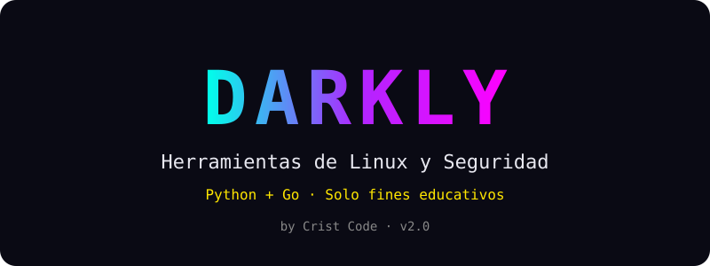
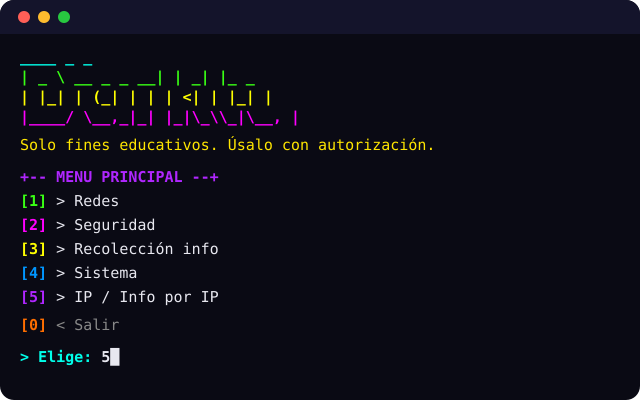

# Darkly Tools

<p align="center">
  
</p>


Colección educativa de herramientas de **Linux, redes y seguridad**, en español, con banner neón y menús con color. **Python + Go juntos**: lo mismo en ambos lenguajes, JSON entre ellos.

> 📚 **Solo fines educativos.** Úsalo con responsabilidad y autorización. El escaneo de puertos pide confirmación explícita.

## ✨ Funciones

| Módulo | Qué hace |
|---|---|
| 🌐 Redes | DNS con respaldo DoH, ping, escaneo de puertos + banner real, traceroute, subredes, versión rápida en Go |
| 🛡️ Seguridad | Hash/identificar, fortaleza y generador (auto-verificado), auditoría HIBP k-anonymity, cabeceras, detector de phishing |
| 🔎 OSINT pasivo | GeoIP triple fuente, PTR preciso, RDAP, WHOIS, registros DNS, subdominios crt.sh, GitHub, usuarios en 17 sitios |
| 🖥️ Sistema | Sysinfo, disco, CPU/RAM, uptime, procesos, hash y verificación de archivos, permisos, logs |
| 📁 IP / Info | Acepta IP o dominio, informe 10/10 con mapa, **auto-guarda HTML + TXT + CSV + PDF** |

## 🚀 Uso rápido

```bash
# 1) Python (requerido) — desde la carpeta DARKY
pip install -r requirements.txt
python darkly.py            # menú interactivo
python darkly.py --version  # ver versión

# 2) Go (opcional, activa los módulos rápidos)
cd go
go build -o darkly-go.exe . # compila el binario
./darkly-go.exe menu        # menú 100% en Go
```


<p align="center">
  
</p>

## 📁 Estructura

```
darkly.py            # menú neón en español
tools/               # networking, security, gathering, username, system_tools, reporter, gospeed
go/                  # darkly-go v2.1: los mismos módulos en Go (scan, dns, audit, report, menu...)
reportes/            # se auto-crea al usarlo (no se sube a git)
```

## ⚙️ Cómo funciona

**Idea general:** dos programas que hacen lo mismo y se complementan. `darkly.py` es el menú principal en Python; `darkly-go` es el gemelo en Go, más rápido en red gracias a goroutines. Se hablan con **JSON por stdout**: Python puede llamar cualquier subcomando Go con `tools.gospeed.go_run(...)` y si Go no está instalado usa su propio código automáticamente.

**Flujo de datos:**
1. El menú pide un objetivo (IP o dominio) y lo valida.
2. Cada herramienta consulta fuentes públicas o el sistema local. Nada es intrusivo: sin exploits, sin logins, sin fuerza bruta.
3. La salida se muestra en tabla neón y, en el caso de IPs, se **auto-guarda** en `reportes/` (HTML + TXT + CSV + PDF) con índice actualizable.

**Módulo por módulo:**
- **Redes:** resuelve DNS primero con el sistema y si falla usa DoH (`one.one.one.one`, que resiste redes con filtro TLS). El port scan abre conexiones TCP en paralelo (50 hilos Python / 100 goroutines Go) y para cada puerto abierto lee el banner real del servicio en vez de solo decir "abierto".
- **Seguridad:** los hashes se calculan localmente. La auditoría HIBP usa k-anonymity: solo viajan los 5 primeros caracteres del SHA-1, tu clave nunca sale del equipo, y las respuestas se cachean en memoria. El detector de URLs puntúa heurísticas (truco `@`, IP cruda, punycode, TLD raro, puerto inusual).
- **OSINT:** GeoIP prueba 3 fuentes en orden (ip-api → ipapi.co → ipwho.is) y normaliza los campos para que los reportes y mapas funcionen igual. El PTR valida el tipo de IP (privada/loopback/reservada) antes de consultar y usa DoH como respaldo. RDAP va por HTTPS (puerto 443) porque el WHOIS clásico (puerto 43) suele estar bloqueado. Los subdominios salen de crt.sh con reintentos y respaldo HackerTarget. La búsqueda de usuarios abre perfiles públicos y marca como "indicio" los sitios con login/JS que dan falsos positivos.
- **Sistema:** todo local con `psutil` (CPU, RAM, uptime, procesos) y lectura de archivos por bloques para hashes de hasta 500 MB, con verificación contra hash esperado.
- **Reportes:** `tools/reporter.py` genera los 4 formatos + índice; el TXT lleva 8 secciones y resumen ejecutivo, el HTML trae mapa embebido si hay coordenadas.

## 🎯 Precisión anti-fallos

- DoH por `one.one.one.one` (resiste redes con filtro TLS), geo triple con normalización
- RDAP por HTTPS en vez de WHOIS, crt.sh con reintentos + respaldo HackerTarget
- Ping/tracert decodificados OEM→UTF-8, puertos con banner real, URLs con heurística honesta

## 👤 Autor

**Crist Code** — https://github.com/hackcrist/darkly
