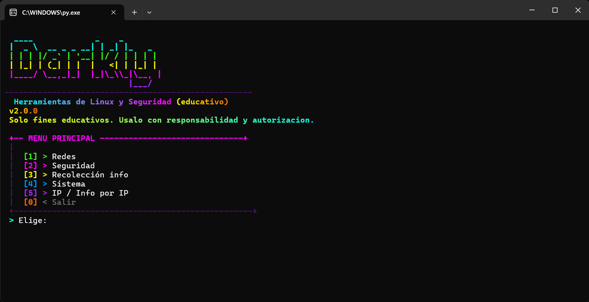
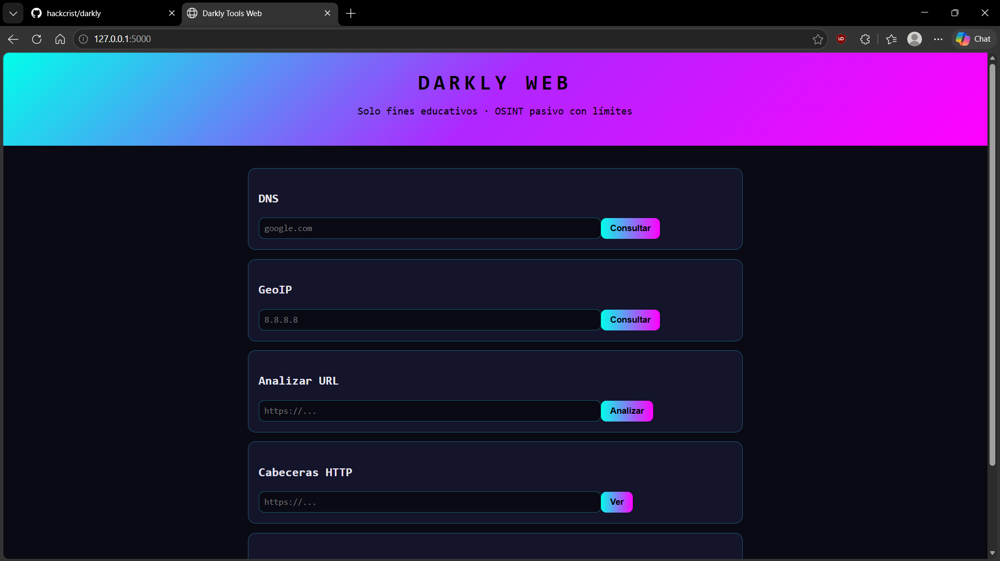
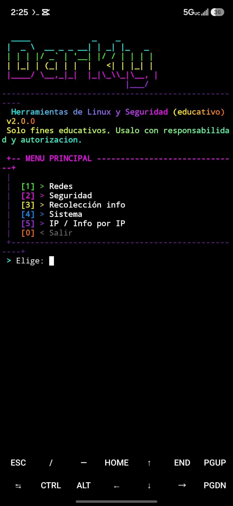

# Darkly Tools

<p align="center">
  
</p>


Colección educativa de herramientas de Linux, redes y seguridad, en español, con banner neón y menús con color. **Python + Go juntos**: lo mismo en ambos lenguajes, con JSON entre ellos.

> **Solo fines educativos.** Úsalo con responsabilidad y autorización. El escaneo de puertos pide confirmación explícita.

## Índice

- [Requisitos](#requisitos) · [Instalación](#instalación) · [Uso](#uso)
- [Módulos](#módulos) · [Comandos Go](#comandos-go) · [API web](#api-web)
- [Reportes](#reportes) · [Cómo funciona](#cómo-funciona) · [Estructura](#estructura)
- [Precisión](#precisión-anti-fallos) · [FAQ](#faq) · [Autor](#autor)

## Requisitos

- Python 3.10 o superior.
- Go 1.21 o superior (opcional, activa los módulos rápidos).
- Conexión a internet para las fuentes OSINT y las APIs públicas.

## Instalación

```bash
# 1) Clona el repositorio
git clone https://github.com/hackcrist/darkly.git
cd darkly

# 2) Python (requerido)
pip install -r requirements.txt

# 3) Go (opcional)
cd go
go build -o darkly-go.exe .   # en Linux: go build -o darkly-go .
```

En Android usa Termux (desde F-Droid o GitHub, no Play Store):

```bash
pkg install git python -y
git clone https://github.com/hackcrist/darkly.git
cd darkly
python install.py
```

El instalador `install.py` detecta Termux, Linux o Windows, instala dependencias, pip y compila `darkly-go` solo. Sin root funciona todo menos algunos modos de traceroute.

## Uso

```bash
python darkly.py            # menú interactivo
python darkly.py --version  # ver versión
./darkly-go.exe menu        # menú 100% en Go (desde go/)
```

Menú principal:

| Opción | Contenido |
|---|---|
| 1) Redes | DNS, ping, puertos, traceroute, subred, banner, versiones Go |
| 2) Seguridad | Hash, fortaleza, generador, cabeceras, URL, auditoría HIBP |
| 3) Recolección | IP, headers, PTR, WHOIS, RDAP, usuarios, DNS, subdominios, GitHub |
| 4) Sistema | Info, disco, CPU/RAM, uptime, procesos, archivos, permisos, logs |
| 5) IP | Informe completo por IP o dominio con auto-guardado |
| 0) Salir | Cierra el programa |

<p align="center">
  
</p>

## Capturas

| Web | Termux |
|---|---|
|  |  |

## Módulos

| Módulo | Qué hace |
|---|---|
| Redes | DNS con respaldo DoH, ping, escaneo de puertos con banner real, traceroute, subredes, DNS y escaneo rápidos en Go |
| Seguridad | Hash e identificación, fortaleza y generador auto-verificado, auditoría HIBP con k-anonymity y caché, cabeceras, detector de phishing |
| OSINT pasivo | GeoIP triple fuente, PTR preciso, RDAP, WHOIS, registros DNS, subdominios crt.sh, perfil GitHub, usuarios en 17 sitios |
| Sistema | Sysinfo, disco, CPU/RAM, uptime, procesos, hash y verificación de archivos, permisos, logs |
| IP / Info | Acepta IP o dominio, informe 10/10 con mapa y auto-guardado en 4 formatos |

## Comandos Go

```bash
./darkly-go.exe scan --host 127.0.0.1 --ports 22,80,443   # escaneo concurrente
./darkly-go.exe dns --host google.com                     # DNS sistema + DoH
./darkly-go.exe audit 'mi-clave'                          # fortaleza + filtración
./darkly-go.exe ipinfo 8.8.8.8                            # geo triple fuente
./darkly-go.exe user torvalds                             # 17 sitios
./darkly-go.exe report --ip 8.8.8.8 --nombre casa         # HTML+TXT+CSV+PDF
./darkly-go.exe menu                                      # menú interactivo
```

Resto: `ping subnet traceroute hash hashid pass genpass breach headers urlscan ptr rdap whois dnsrecords subdomains ghuser sysinfo filehash verify version`.

## API web

```bash
pip install -r requirements-web.txt
python webapp.py   # http://127.0.0.1:5000
```

Endpoints de lectura con límite por IP: `/api/health`, `/api/dns`, `/api/geo`, `/api/ptr`, `/api/rdap`, `/api/headers`, `/api/urlscan`, `/api/hash`, `/api/subdomains`, `/api/ghuser`, `/api/user`. La verificación de contraseñas solo por `POST /api/breach` (nunca viaja en la URL ni queda en logs).

Variables de entorno:

| Variable | Defecto | Efecto |
|---|---|---|
| `DARKLY_TOKEN` | (vacío) | Token exigido en cabecera `X-Token` para `/api/scan` |
| `ENABLE_SCAN` | `0` | En `1` activa el escaneo (requiere token válido) |
| `RATE_LIMIT_ENABLED` | `1` | En `0` desactiva los límites (solo desarrollo local) |
| `TRUST_PROXY` | `0` | En `1` usa `X-Forwarded-For` como IP cliente (solo detrás de proxy propio) |
| `PORT` | `5000` | Puerto de escucha |

El límite es por IP y minuto (de 5 a 60 según el costo del endpoint) con limpieza automática en memoria. Despliegue sugerido: Render o Railway con `gunicorn webapp:app`.

## Reportes

Cada consulta de IP genera HTML + TXT + CSV + PDF en `reportes/` (carpeta auto-creada, no se sube a git) con índice `index.html`:

- TXT de 8 secciones: geo, PTR, RDAP, DNS, ping, puertos, headers y resumen ejecutivo.
- HTML con mapa embebido cuando hay coordenadas.
- CSV en formato campo/valor y PDF simple sin dependencias.

## Cómo funciona

Dos programas que hacen lo mismo y se complementan. `darkly.py` es el menú principal en Python; `darkly-go` es el gemelo en Go, más rápido en red gracias a goroutines. Se comunican con **JSON por stdout**: Python puede llamar cualquier subcomando Go con `tools.gospeed.go_run(...)` y si Go no está instalado usa su propio código automáticamente.

Flujo de datos:

1. El menú pide un objetivo (IP o dominio) y lo valida.
2. Cada herramienta consulta fuentes públicas o el sistema local. Nada es intrusivo: sin exploits, sin logins, sin fuerza bruta.
3. La salida se muestra en tabla y, en el caso de IPs, se auto-guarda en `reportes/` con índice actualizable.

Detalle por módulo:

- **Redes:** resuelve DNS primero con el sistema y si falla usa DoH (`one.one.one.one`, que resiste redes con filtro TLS). El port scan abre conexiones TCP en paralelo (50 hilos Python / 100 goroutines Go) y para cada puerto abierto lee el banner real del servicio en vez de solo decir "abierto".
- **Seguridad:** los hashes se calculan localmente. La auditoría HIBP usa k-anonymity: solo viajan los 5 primeros caracteres del SHA-1, la clave nunca sale del equipo, y las respuestas se cachean en memoria. El detector de URLs puntúa heurísticas (truco `@`, IP cruda, punycode, TLD raro, puerto inusual).
- **OSINT:** GeoIP prueba 3 fuentes en orden (ip-api, ipapi.co, ipwho.is) y normaliza los campos para que reportes y mapas funcionen igual. El PTR valida el tipo de IP (privada, loopback, reservada) antes de consultar y usa DoH como respaldo. RDAP va por HTTPS (puerto 443) porque el WHOIS clásico (puerto 43) suele estar bloqueado. Los subdominios salen de crt.sh con reintentos y respaldo HackerTarget. La búsqueda de usuarios abre perfiles públicos y marca como "indicio" los sitios con login o JS que dan falsos positivos.
- **Sistema:** todo local con `psutil` (CPU, RAM, uptime, procesos) y lectura de archivos por bloques para hashes de hasta 500 MB, con verificación contra hash esperado.
- **Reportes:** `tools/reporter.py` genera los 4 formatos más índice.

## Estructura

```
darkly.py            # menú neón en español
install.py           # instalador multiplataforma (Termux/Linux/Windows)
webapp.py + web/     # API + web pública (Flask, segura por defecto)
tools/               # networking, security, gathering, username, system_tools, reporter, gospeed
go/                  # darkly-go v2.1 con los mismos módulos en Go
reportes/            # se auto-crea al usarlo (no se sube a git)
assets/              # logo y capturas del README
```

## Precisión anti-fallos

- DoH por `one.one.one.one` (resiste redes con filtro TLS), geo triple con normalización.
- RDAP por HTTPS en vez de WHOIS, crt.sh con reintentos y respaldo HackerTarget.
- Ping y tracert decodificados de OEM a UTF-8, puertos con banner real, URLs con heurística honesta.
- SSL con `certifi` en todas las funciones HTTPS.

## FAQ

**Error SSL o CERTIFICATE_VERIFY_FAILED.**
Instala certificados con `pip install -r requirements.txt` (incluye `certifi`). Si tu red tiene filtro TLS (escuela o trabajo), algunos endpoints se interceptan: el programa ya prefiere los que verifican limpio.

**WHOIS dice "puerto 43 bloqueado".**
Normal en redes filtradas. Usa la opción RDAP, que va por HTTPS y entrega lo mismo.

**crt.sh falla o tarda.**
Su servidor es inestable (responde 502 a ratos). Hay 3 reintentos con respaldo HackerTarget automáticos.

**npm, Telegram o Medium salen "bloqueados".**
Esas páginas bloquean bots. npm se consulta por su API oficial; el resto se marca como indicio y se verifica a mano en el navegador.

**Sin registro PTR.**
Significa que el dueño de la IP no creó reverso. Normal en móviles y nubes. No es error del programa.

**Go no se reconoce.**
Instálalo desde https://go.dev/dl/ y abre una terminal nueva (el PATH se actualiza al reabrir).

## Autor

**Crist Code** — https://github.com/hackcrist/darkly

Si te sirve, deja una estrella en GitHub.
